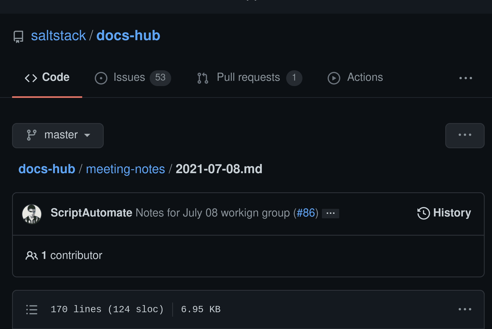
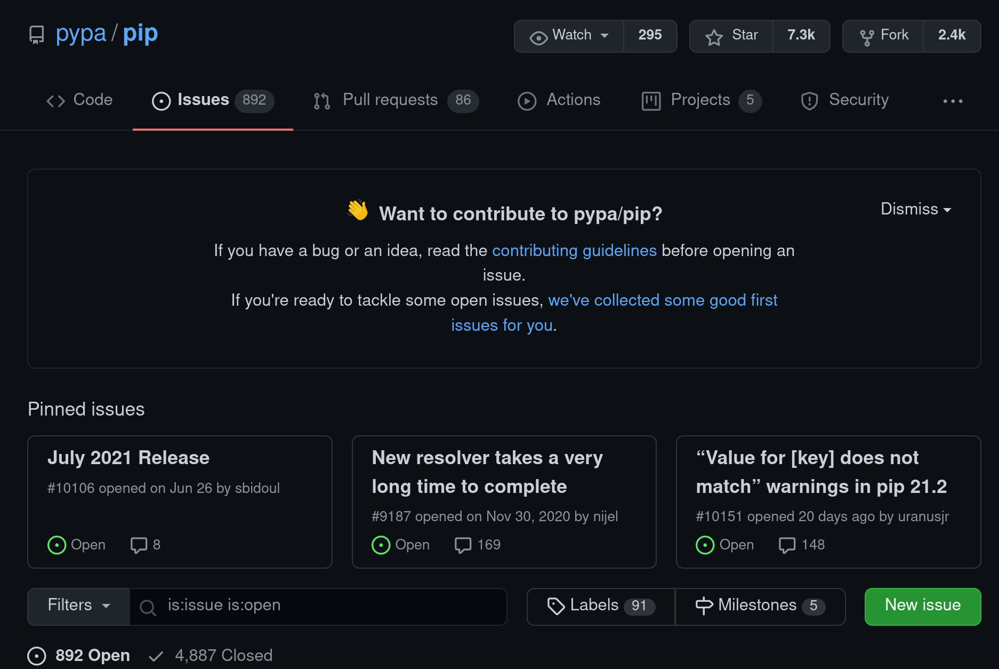
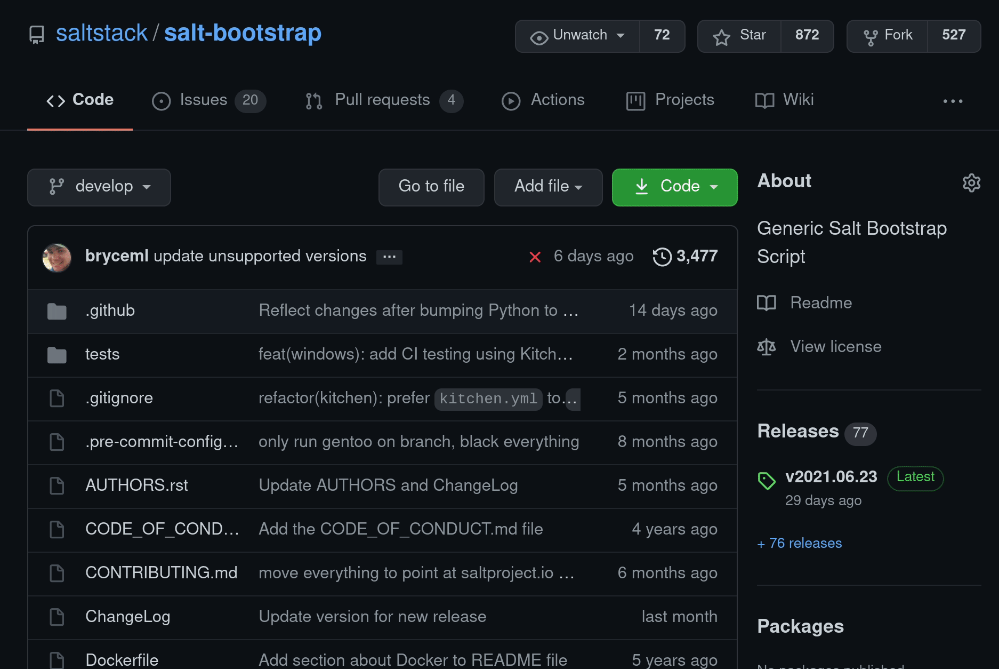

# 2021-07-29 Meeting

## Attendees

- Derek Ardolf
- Bryce Larson
- Gary Giesen
- Gareth Greenaway
- Dave Boucha

## Updates

- Next meeting will be a "working" working group, where we use the time to work on tasks
  - Meetings, moving forward, are working meetups (at least until `salt-user-guide`
    and `salt-install-guide` are in MVP states and published)
- Paths for `docs.saltproject.io` publishing were logged in a previous working group for follow-up
  - [Meeting notes for 2021-07-08](https://github.com/saltstack/docs-hub/blob/master/meeting-notes/2021-07-08.md)

## What we worked on this meeting

**Derek**

- Currently updating `repo.saltproject.io`, before dedicating time to `salt-install-guide`
  - Updating the page with content related to single-binary
  - Reference as **Single-binary (BETA)**

**Gary**

- `salt-user-guide` cleanup tickets/issues

**Bryce**

- Meticulously reviewing Derek's work

**Dave**

- Also meticulously reviewing Derek's work

**Gareth**

- Delta proxy docs: should they belong in the `salt-user-guide` or the `salt-install-guide`?
  - Will be included in Silicon
  - Perhaps belongs in `salt-user-guide`, since it is a `salt` configuration and is available out-of-box

### GitHub/GitLab features of note

Misc. features noticed that GitHub provides.

#### Autogenerated TOCs

A similar experience can be seen in GitLab repos.

> Example from [salt/salt-bootstrap](https://github.com/saltstack/salt-bootstrap)

**Newer issue template experience**

> Example from [pypa/pip](https://github.com/pypa/pip/issues/new/choose)

**Code-block copy buttons in Markdown**

Normally, only copy buttons appear in HTML rendered docs, but this looks to be changing (at least, with Markdown files, issues, and PRs, on GitHub).

> Example from [salt/salt-bootstrap](https://github.com/saltstack/salt-bootstrap)

## Next steps

- Publish the `salt-user-guide` to `docs.saltproject.io/salt/user-guide/`
- Publish the `salt-install-guide` to `docs.saltproject.io/salt/install-guide/`
- See about implementing Algolia (or simply DuckDuckGo) for the current as-is docs portal

### Misc tasks

- Update docs landing page for book link:
  - Old link: http://www.oreilly.com/webops-perf/free/network-automation-at-scale.csp
  - New link: https://www.cloudflare.com/network-automation-at-scale-ebook/
- Duplicate content from [VMware KB on Upgrading Salt](https://kb.vmware.com/s/article/50122319?lang=en_US&queryTerm=upgrading+your+salt+infrastructure) to install guide via [issue in `salt-install-guide`](https://gitlab.com/saltstack/open/docs/salt-user-guide/-/merge_requests/57)
  - Recent **Salt Air** mentioned that the `salt-master` doesn't need to be upgraded before minions
    - Upgrade documentation can say that we **recommend** upgrading the `salt-master` before upgrading minions.
- Add [Quick Guide to Vault Integration](https://web.archive.org/web/20210306232428/https://help.saltstack.com/hc/en-us/articles/360041140451-Quick-Guide-to-Vault-Integration) tutorial to `salt-user-guide`
- [Modify the main landing page of `salt-install-guide`](https://gitlab.com/saltstack/open/docs/salt-install-guide/-/issues/13)
- Confirm that Google tagging and analytics are stripped out where currently existing
- DuckDuckGo: Simple poc for docs landing `docs.saltproject.io`

## Going forward

The goal of the next Salt Docs Working Group is to continue our action-oriented
approach: assigning issues, seeking help with issues, and working toward achieving
the long-term goals by completing tasks step-by-step. We'll go over issues available,
MRs/PRs needing review/feedback, and what progress has been made.

The current focus will continue be on:
- [`salt-user-guide`](https://gitlab.com/saltstack/open/docs/salt-user-guide)
- [`salt-install-guide`](https://gitlab.com/saltstack/open/docs/salt-install-guide)

Issues are available in both repos, and are open for contributions!
